<!--START_SECTION:waka-->

<!--END_SECTION:waka-->

<!--Hi there 👋🏿 I am a dedicated full-stack engineer with expertise in agile methodologies and DevOps practices. 

<!--I'm always online on Whatsapp if you want to chat or collaborate. [Just click here](https://wa.me/+254701746774)  

<!---->

<!-- ### 🛠 &nbsp;Tech Stack

- 📱 &nbsp;Mobile:&nbsp;
  
- 🗄 &nbsp;Backend:&nbsp;
  
- 🌐 &nbsp;Frontend:&nbsp;
  
  
  
- 🛢 &nbsp;Database:&nbsp;
  
  
  
- ⚙️ &nbsp;VCS: &nbsp;
  
  
  
- 🔧 &nbsp;IDE's:&nbsp;
  
  
  
  
   -->
<!--

  
    
  
  
    
  
  
    
  -->

     
  
  <!-- 
    
  
  
    
  
  
    
  

-->

